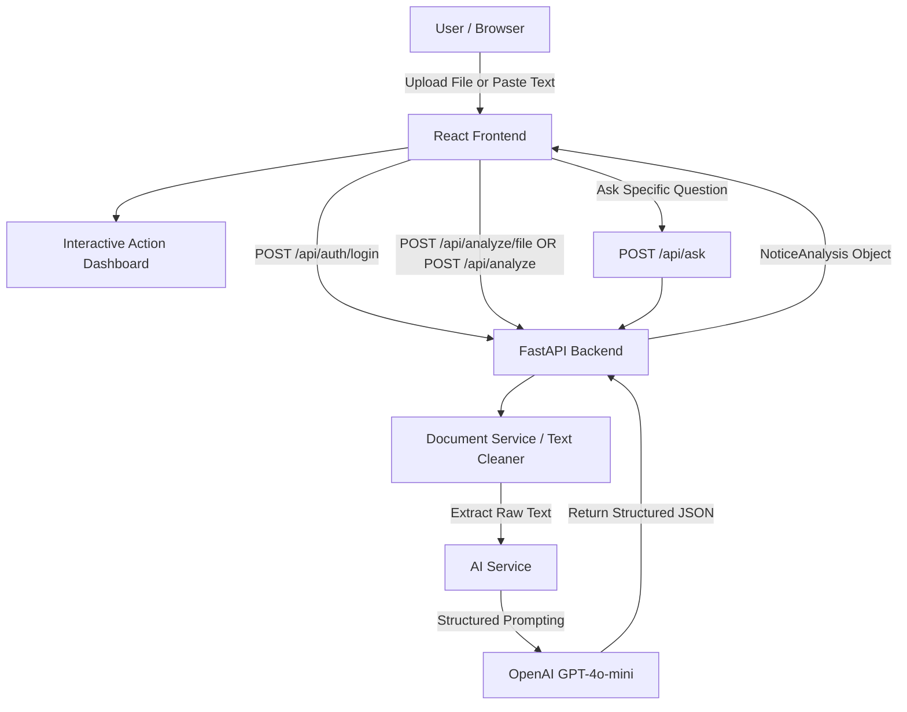

# 📜 Notice2Action

> **From Unstructured Circulars to Clear, Actionable Dashboards.**  
> *Built for Hackathons — Powered by FastAPI & React + TypeScript.*

---

## 💡 What is Notice2Action?

Students, professionals, and citizens frequently receive long, complex, and unstructured public notices, college announcements, circulars, and PDFs. Key deadlines, eligibility rules, required documents, and mandatory action items are often buried inside walls of text, leading to missed opportunities and costly delays.

**Notice2Action** converts any raw notice (PDF, DOCX, TXT, or direct text paste) into a **structured, interactive action dashboard**.

```
  [ Upload / Paste Notice ] ──► [ AI Analysis ] ──► [ Deadline + Urgency Tags ]
                                               ├──► [ Action Checklist ]
                                               ├──► [ Eligibility Criteria ]
                                               └──► [ AI Q&A Assistant ]
```

---

## ✨ Key Features

- 📄 **Multi-Format Document Upload**: Supports PDF (`pdfplumber` + `PyPDF2` fallback), Word documents (`python-docx`), and plain text files.
- 📝 **Direct Text Snippet UI**: Paste raw notice text directly into the UI dual-tab analyzer powered by `POST /api/analyze`.
- ⚡ **AI Analysis Pipeline**: Powered by OpenAI `gpt-4o-mini` to automatically extract key takeaways, summaries, and eligibility conditions.
- ⏰ **Deadline & Urgency Classification**: Automatically highlights critical dates and assigns Urgency levels (**High**, **Medium**, **Low**).
- 📋 **Interactive Action Checklist**: Turns complex requirements into a checkable task list with browser storage persistence.
- 💬 **Ask Notice2Action Assistant**: Context-aware Q&A chat panel allows users to ask specific questions about notice content.
- 🔐 **FastAPI Backend Authentication**: Dedicated auth router handling `/api/auth/login` and `/api/auth/register` requests.
- 📂 **Notice History (`My Notices`)**: Save, search, filter by urgency, and manage past analyzed notices offline.
- 🌓 **Modern Aesthetics & Dark Mode**: Built with Tailwind CSS v3, custom SVG iconography, glassmorphism, responsive mobile drawers, and dark/light themes.

---

## 🛠️ Technology Stack

### **Frontend**
- **Framework**: React 19 + TypeScript + Vite
- **Styling**: Tailwind CSS v3 + Custom Design Tokens + Dark Mode
- **Icons**: Lucide React + Custom Notice2Action SVG Branding
- **State & Persistence**: React Hooks + Browser LocalStorage

### **Backend**
- **Framework**: FastAPI (Python 3.10+)
- **Server**: Uvicorn
- **AI Service**: OpenAI API (`gpt-4o-mini`) + `python-dotenv`
- **Document Parsing**: `pdfplumber`, `PyPDF2`, `python-docx`
- **Testing**: `pytest` + `httpx` TestClient
- **Validation**: Pydantic v2

---

## 🏗️ Architecture Flow



---

## 🚀 Quick Start (Local Setup)

### Prerequisites
- **Node.js**: `v18+`
- **Python**: `3.10+`
- **OpenAI API Key**: Obtain from [platform.openai.com](https://platform.openai.com)

---

### 1. Backend Setup

```bash
# Navigate to backend directory
cd backend

# Create virtual environment
python -m venv venv
# On Windows:
venv\Scripts\activate
# On macOS/Linux:
source venv/bin/activate

# Install Python dependencies
pip install -r requirements.txt

# Create .env file with your OpenAI API Key
echo OPENAI_API_KEY=your-openai-api-key > .env
echo OPENAI_MODEL=gpt-4o-mini >> .env

# Run FastAPI server
uvicorn app.main:app --reload --port 8000
```
> Backend running at: `http://127.0.0.1:8000`  
> Interactive Swagger UI: `http://127.0.0.1:8000/docs`

---

### 2. Frontend Setup

```bash
# Navigate to frontend directory
cd frontend

# Install node dependencies
npm install

# Run Vite dev server
npm run dev
```
> Frontend running at: `http://localhost:5173`

---

## 📡 API Reference Overview

| Endpoint | Method | Description | Request Payload |
|---|---|---|---|
| `/api/analyze/file` | `POST` | Analyze uploaded document file (PDF, DOCX, TXT) | `multipart/form-data` (`file`) |
| `/api/analyze` | `POST` | Analyze raw notice text snippet | `application/json` (`{"text": "..."}`) |
| `/api/ask` | `POST` | Ask context-aware question about notice text | `application/json` (`{"notice_text": "...", "question": "..."}`) |
| `/api/auth/login` | `POST` | Authenticate user session | `application/json` (`{"email": "...", "password": "..."}`) |
| `/api/auth/register` | `POST` | Register new user account | `application/json` (`{"name": "...", "email": "...", "password": "..."}`) |
| `/api/health` | `GET` | Backend service health check | None |

> 📖 **Full Endpoint Schemas**: For detailed request/response JSON schemas, inspect [backend/README.md](backend/README.md).  
> 🎨 **Frontend Architecture**: For component tree and state management details, inspect [frontend/README.md](frontend/README.md).

---

## 🧪 Testing & Verification

### Backend Automated Test Suite
Run unit tests for endpoints (Health, Auth, Routes):
```bash
cd backend
pytest
```

### Frontend Type & Build Verification
Verify TypeScript compilation and production bundle build:
```bash
cd frontend
npm run build
```

---

## 🌐 One-Click Render Deployment

This project includes a `render.yaml` Blueprint file for automatic full-stack deployment on [Render](https://render.com).

1. Push this repository to GitHub.
2. Log into [Render Dashboard](https://dashboard.render.com/) and click **New +** → **Blueprint**.
3. Select your `Notice2Action` repository.
4. Set the `OPENAI_API_KEY` environment variable when prompted.
5. Click **Apply**. Render will automatically build and deploy both backend and static frontend!


